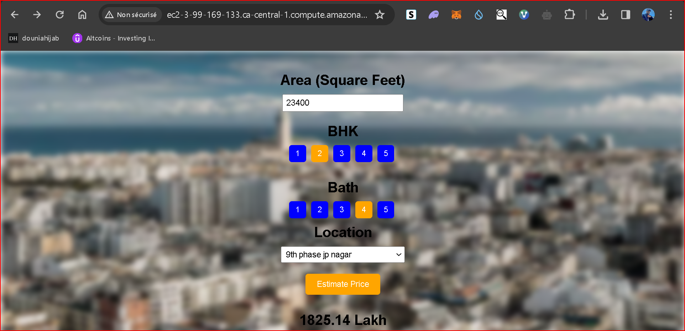

# House Price Prediction App

## Overview
This is a Python application for predicting house prices in Bangalore. It utilizes various libraries such as numpy, scikit-learn, and pandas for data manipulation and machine learning, and Flask for building the web application.

## Installation
- Clone the repository.
- Install the required dependencies using pip: `pip install -r requirements.txt`.
- Run the Flask application: `python server.py`.

## Usage
- Navigate to the provided AWS EC2 URL to access the application.
- Input the necessary parameters to get an estimated house price.

## Deployment
The application is deployed on an AWS EC2 instance. Access the live application at [http://ec2-3-99-169-133.ca-central-1.compute.amazonaws.com/](http://ec2-3-99-169-133.ca-central-1.compute.amazonaws.com/).

